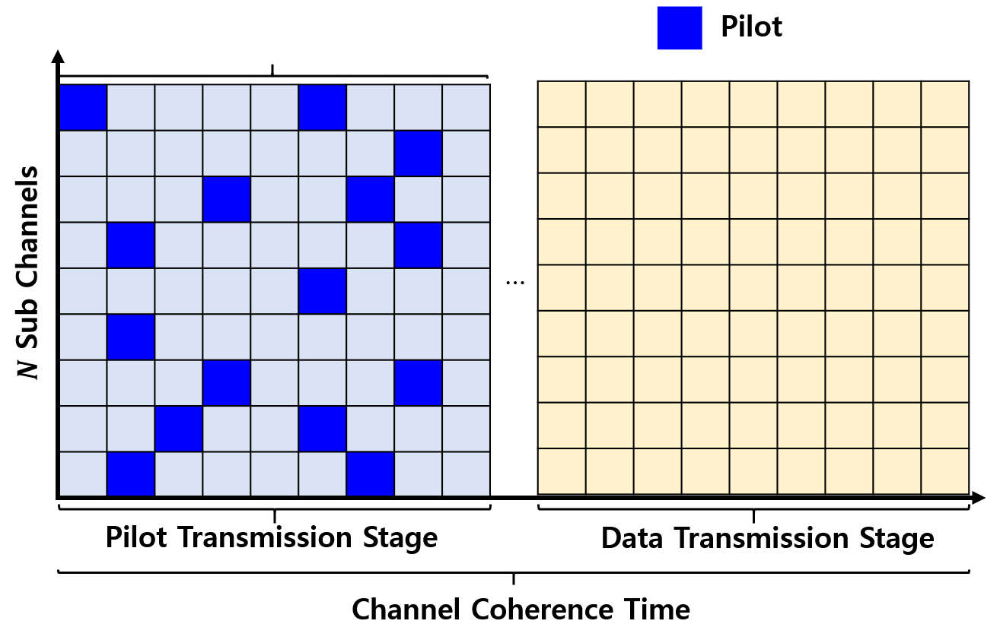
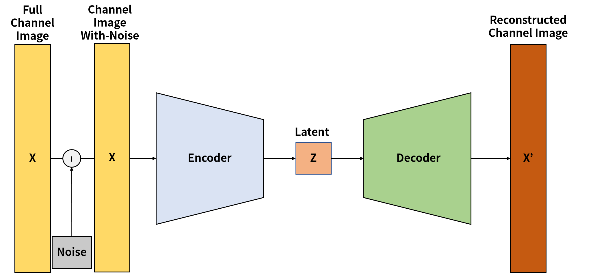

# Autoencoder-based Channel Estimator
Accurate channel estimation is an essential factor in determining the efficiency of a wireless communication system. Moreover, in Reconfigurable Intelligent Surfaces(RIS)-Assisted wireless networks using millimeter wave(mmWave), it is crucial to optimize each RIS element's phase shift. Therefore, in this paper, we propose a channel estimation method in TDD-based wireless communication system using autoencoder in RIS-Assisted wireless networks. The trade-off relationship between channel estimation accuracy and the number of pilot signals is optimized when performing channel estimation. Through denoising autoencoder and Average Percentage of Zeros(APoZ), we find the optimal pilot pattern considering not only the number of pilots but also the location. As a result of the experiment, the proposed method has little difference in performance or outperforms the full neural network without pruning.

An autoencoder is a neural network that copies input to an output and consists of two parts : an encoder and a decoder. The encoder part also called a recognition network, transforms the input into an internal representation, and the decoder, also called a generative network, transforms the internal representation into an output. It is a simple neural network, but it makes a complex neural network by constraining the autoencoder network in various ways. These constraints prevent the autoencoder from simply copying the input directly to the output and controlling it to learn how to represent the data efficiently.

# Needed Tools and Versions
- Matlab R2022a
- 5G Toolbox
- Deep Learning Toolbox

# License
Copyright (c) 2022 Networking Intelligence
Redistribution and use in source and binary forms, with or without modification, are permitted provided that the following conditions are met:

1. Redistributions of source code must retain the above copyright notice, this list of conditions and the following disclaimer.

2. Redistributions in binary form must reproduce the above copyright notice, this list of conditions and the following disclaimer in the documentation and/or other materials provided with the distribution.

THIS SOFTWARE IS PROVIDED BY THE COPYRIGHT HOLDERS AND CONTRIBUTORS "AS IS" AND ANY EXPRESS OR IMPLIED WARRANTIES, INCLUDING, BUT NOT LIMITED TO, THE IMPLIED WARRANTIES OF MERCHANTABILITY AND FITNESS FOR A PARTICULAR PURPOSE ARE DISCLAIMED. IN NO EVENT SHALL THE COPYRIGHT HOLDER OR CONTRIBUTORS BE LIABLE FOR ANY DIRECT, INDIRECT, INCIDENTAL, SPECIAL, EXEMPLARY, OR CONSEQUENTIAL DAMAGES (INCLUDING, BUT NOT LIMITED TO, PROCUREMENT OF SUBSTITUTE GOODS OR SERVICES; LOSS OF USE, DATA, OR PROFITS; OR BUSINESS INTERRUPTION) HOWEVER CAUSED AND ON ANY THEORY OF LIABILITY, WHETHER IN CONTRACT, STRICT LIABILITY, OR TORT (INCLUDING NEGLIGENCE OR OTHERWISE) ARISING IN ANY WAY OUT OF THE USE OF THIS SOFTWARE, EVEN IF ADVISED OF THE POSSIBILITY OF SUCH DAMAGE.
